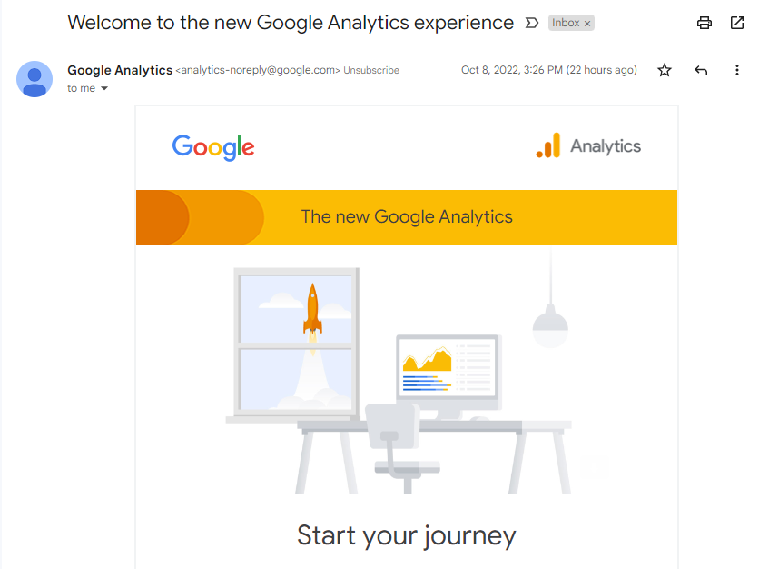

# Learn GCP / Google Analytics #

This documentation explains how to configure and use Google Analytics.

* [Introduction](#introduction)
* [Set Up Account](#set-up-account)
* [Google Analytics 4 Setup](#google-analytics-4-setup)
* [Add Google Analytics 4 property (to a site that already has Analytics)](#add-google-analytics-4-property-to-a-site-that-already-has-analytics)
* [Additional Google Analytics 4 Configuration](#additional-google-analytics-4-configuration)
    + [Filter Out Publishing Organization](#filter-out-publishing-organization)
    + [Handle Subdomains](#handle-subdomains)

---------

## Introduction ##

Google Analytics is a free service that tracks visits to public web pages.
Each web page must embed a snippet of code that calls the Google Analytics service
when the page is viewed, and Google keeps track of visits.
A Google analytics "property" (unique identifier) is used to track an organization's data.
The data can then be viewed on a dashboard.

Google does have access to the data but so does the organization that uses the service.

The first generation of Google Analytics used a "Universal Analytics property"
whereas the current generation uses a "Google Analytics 4 property".
The property must be properly handled.

## Set Up Account ##

To use Google Analytics, first set up an account.

* [Get started with data analytics](https://support.google.com/analytics/answer/9306384?hl=en)

After setting up an account, a URL similar to the following will show the ***Analytics*** dashboard.

```
https://analytics.google.com/analytics/web/
```

Additional tasks include:

* [Migrate Users from UA to GA4](https://support.google.com/analytics/answer/11894572) - although
  this seems to be done automatically when Google Analytics 4 is set up?

## Google Analytics 4 Setup ##

**This documentation was created on 2022-10-08**.

Google Analytics 4 setup may occur for a new account or an existing account.
For example, accessing the ***Analytics*** dashboard that uses an old Universal property
provides a link to the following setup assistant,
from which the Google Analytics 4 property can be created:

**<p style="text-align: center;">

</p>**

**<p style="text-align: center;">
Google Analytics 4 Property Setup Assistant (<a href="../setup-assistant-1.png">see full-size image</a>)
</p>**

Note that, as to be expected, the old and new Google Analytics features are not totally compatible.
The checkbox at the bottom to enable data collection using the existing global site tag is not selected,
which requires updating all Google Analytics pages to use the new Google Analytics 4 properties.
This is done to ensure complete data collection.  Press ***Get Started***.  The following will be shown.

**<p style="text-align: center;">

</p>**

**<p style="text-align: center;">
Create a new Google Analytics 4 property (<a href="../setup-assistant-2.png">see full-size image</a>)
</p>**

Press ***Create property***.  This will create the property and show the `GA4 Property Name` and `Property ID` (an integer).
However, this is not the identifier needed for web page tracking.
Use the Analytics dashboard and ***Settings*** tool to confirm information:

*   Use the ***Data Streams*** tool to ensure that the ***Stream URL*** is expected,
    which should agree with an organization's main URL.
    This also shows the alphanumeric ***Measurement ID*** of form `G-12345ABCDE`,
    which is the identifier needed in web pages to track visits.

Activation of the Google Analytics 4 Property may not be instantaneous,
which can be frustrating because a "Data not flowing" message may be shown.
An email is sent by Google to the account administrator indicating that Analytics is updated,
for example as shown below.

**<p style="text-align: center;">

</p>**

**<p style="text-align: center;">
Google Analytics Welcome Email (<a href="../analytics-welcome-email.png">see full-size image</a>)
</p>**

At about the time that this is received,
the data stream should show "Data is flowing" and "Data collection is active in the past 48 hours",
as shown below.

**<p style="text-align: center;">

</p>**

**<p style="text-align: center;">
Web Stream Details for Active Data Collection (<a href="../web-stream-details.png">see full-size image</a>)
</p>**

## Add Google Analytics 4 property (to a site that already has Analytics) ##

The following documentation to add analytics to a site that is already using analytics,
such as the older Universal property:

* [Add a Google Analytics 4 property (to a site that already has Analytics)](https://support.google.com/analytics/answer/9744165?hl=en&utm_id=ad)

If using MkDocs, WordPress, or other website authoring tool,
see the documentation for those tools for information on configuring Google Analytics 4.

## Additional Google Analytics 4 Configuration ##

The following sections explain additional details for how to configure Google Analytics 4.

### Filter Out Publishing Organization ###

The organization that publishes web content is often active in viewing those pages.
However, counting those page hits skews the results.
Therefore, it is desirable to filter out the publishing organization's visits.

**Need to explain how...**

### Handle Subdomains ###

An organization's main domain may be used for the public website.
Additional subdomains may be used to publish additional content.
For example, the Open Water Foundation uses the
[https://learn.openwaterfoundation.org](https://learn.openwaterfoundation.org)
website to publish educational information.
Many of the top-level pages on the subdomain sites are similar (e.g., main `/index.html` landing pages)
and specific pages may be difficult to differentiate between websites.
Therefore, it is desirable that analytics differentiate between the subdomains.

**Need to explain how...**
