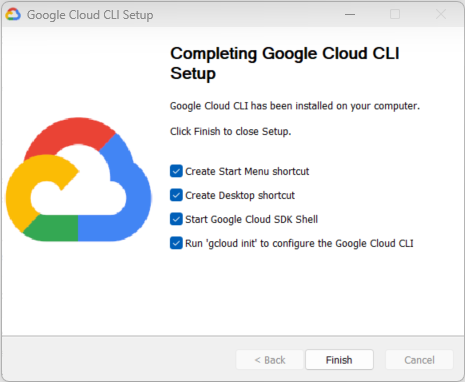

# Learn GCP / Command Line Interface  #

This documentation explains how to install and use the Google Cloud Command Line Interface (CLI).

* [Introduction](#introduction)
* [Installation (Windows)](#installation-widnows)
* [Configure Credentials](#configure-credentials)

---------

## Introduction ##

The Google Cloud Command Line Interface (CLI) can be run
on the command line to automate tasks.

## Installation (Windows) ##

See the [Install the Google Cloud CLI](https://cloud.google.com/sdk/docs/install-sdk) documentation.
This requires downloading and running the `GoogleCloudSDKInstaller.exe` program.

Accept the defaults, including installing for a single user,
which will install in `C:\Users\user\AppData\Local\Google\Cloud SDK`.
The installation includes a bundled version of Python.
The final setup dialog is as follows:

**<p style="text-align: center;">

</p>**

**<p style="text-align: center;">
Google Cloud SDK Installation Complete (<a href="../setup-complete.png">see full-size image</a>)
</p>**

The location of the software is as follows and is also added to the `PATH`, using Git Bash.
Note the space in `Cloud SDK` folder, which can cause issues in scripts and must be escaped with quotes.

```
$ which gcloud
/c/Users/steve/AppData/Local/Google/Cloud SDK/google-cloud-sdk/bin/gcloud
$ which gsutil
/c/Users/steve/AppData/Local/Google/Cloud SDK/google-cloud-sdk/bin/gsutil

```

## Configure Credentials ##

Credentials must be configured to allow command line tools to run without entering a password.
See the "Setting Up Credentials to Access Protected Data" section in the
[Install gsutil](https://cloud.google.com/storage/docs/gsutil_install) documentation.

If credentials exist on another computer or a backup being transferred to a new computer,
copy the user's `.gutil` folder and `.boto` file.
